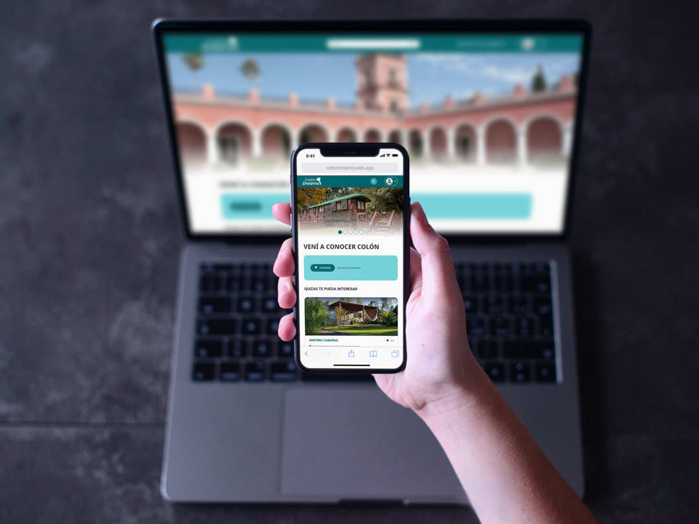

<a href="https://colondreams.web.app/" target="_blank" rel="noopener noreferrer"></img></a>
# Colón Dreams

Presentamos a Colón Dreams, un proyecto de página web responsive desarrollado en el [Cohorte 8 de No Country](https://www.nocountry.tech/developers).

En este sitio, como usuario puedes encontrar alojamientos para tus vacaciones o escapadas de fin de semana al departamento de Colon, Entre Ríos. También, como anfitrión podrás publicar tu alojamiento de una manera sencilla y rápida, pudiendo configurar tu hospedaje con las características, mobiliario y beneficios con los que cuentan, también podrás indicar el precio, la ubicación y datos de contacto para tus futuros clientes.

## Tabla de contenidos

- [Sobre el desarrollo](#sobre-el-desarrollo)
  - [Diseño UX/UI](#👉🏻-diseño)
  - [FrontEnd ](#👉🏻-frontend)
  - [Built with](#built-with)
- [Screenshot](#screenshot)
- [Links](#links)
- [Desarrolladores](#desarrolladores)
- [Comunicación](#comunicación)

 

## Sobre el desarrollo

El proyecto se desarrolló pensando en las personas habitan en el distrito de Colón, Entre Ríos, para que ellas sean capaces de publicar sus alojamientos de manera sencilla e interactiva. Así como también para las personas de cualquier parte que quisieran visitar esta hermosa ciudad que cuenta con muchos atractivos turísticos como playas, islas, reservas naturales entre otros. Puedan encontrar el alojamiento ideal para vacacionar.

 

### 👉🏻 Diseño

El diseño de UX/UI se hizo mendiante reuniones y recolección de requisitos, se hizo los MVPs y se desarrollo las pantallas en media y alta.

</img>
[Maquetado y diseño UX/UI](https://www.figma.com/file/GiVOsWdCQHIpyunD66T9ew/Col%C3%B3n-interfaz-UX%2FUI?node-id=0%3A1&t=jAmdkdE3IRgAsZ9N-1)

 

### 👉🏻 FrontEnd 

Se maqueteo el proyecto utilizando HTML y CSS, en css se utilizó especialmente Flexbox para más adelante, mediante media queries, hacer que el deseño sea responsive. Se hizo uso también de Google Maps API, para los datos de ubicación y mostrar mapas. Para la interactividad del sitio se utilizo JavaScript puro (vanilla) así tambien Jquery algunos casos. Para el inicio se sesión nos ayudamos con Firebase y sus servicios de autenticación

       

## Screenshot

<h3 align="center"  ><b>Puedes revisar nuestra web aquí:</b></h3>
<h3 align="center"><a href="https://colondreams.web.app/" target="_blank" rel="noopener noreferrer"> 🌴 Colón Dreams </a></h3>
 

 

## Links

- Sitio web: [Colón Dreams](https://colondreams.web.app/)
- GitHub: [C8-71-m-jquery](https://github.com/No-Country/C8-71-m-jquery)

 

## Desarrolladores
- UX/UI Designer: Cristian Hernández
  - Github - [crishernandez22](https://github.com/crishernandez22)

- FrontEnd Developer: Arnold Balabarca
  - Github - [arn28](https://github.com/arn28)

 

## Comunicación
  
